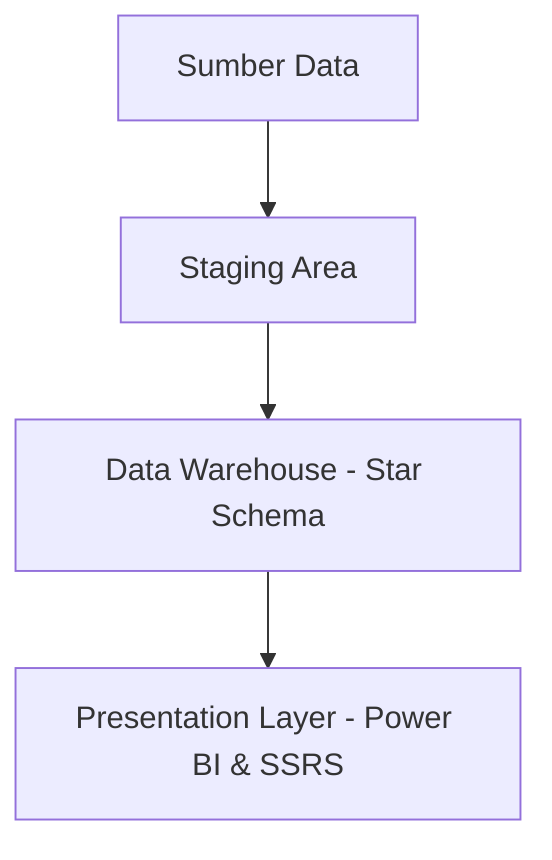

# 🏛️ Perancangan Data Warehouse Disdukcapil 🇮🇩
**Kabinet Data Bersatu** - Sains Data ITERA | 2025  
📁 Proyek Akademik | 🗃️ SQL Server • SSMS • Power BI • SSRS


---

## 📚 Ringkasan Proyek

Repositori ini berisi dokumentasi lengkap proyek perancangan **Data Warehouse (DW)** untuk instansi **Dinas Kependudukan dan Pencatatan Sipil (Disdukcapil)** yang bertujuan untuk meningkatkan efisiensi, transparansi, dan akurasi layanan publik berbasis data.

---

## 🎯 Tujuan Sistem

- 📌 Integrasi data antar wilayah
- 📊 Analisis multidimensi penduduk dan layanan
- ⏱️ Pengambilan keputusan real-time
- 📈 Visualisasi interaktif via Power BI

---

## 🧱 Arsitektur Sistem - Three-Tier Architecture



---

## 🔄 Alur Proses ETL

> ⚠️ Tidak menggunakan SSIS. Semua proses ETL dilakukan secara manual menggunakan **SQL Query di SSMS**.

```sql
-- Contoh skrip ETL manual via SSMS
INSERT INTO dim_jenis_dokumen (kode, nama)
SELECT DISTINCT kode_dok, jenis_dokumen
FROM staging_permohonan
WHERE jenis_dokumen IS NOT NULL;
```

> Ke depan, automasi dapat dipertimbangkan dengan SQL Server Agent untuk menjalankan job terjadwal.

---

## 📁 Struktur Data Warehouse

### 📊 Tabel Fakta

| Nama Tabel         | Deskripsi                            |
|--------------------|---------------------------------------|
| `fakta_population` | Jumlah penduduk                      |
| `fakta_document`   | Permohonan dokumen                   |
| `fakta_service`    | Evaluasi pelayanan publik            |
| `fakta_migration`  | Data perpindahan penduduk            |

### 🧩 Tabel Dimensi

| Nama Dimensi         | Atribut Utama                     |
|----------------------|-----------------------------------|
| `dim_waktu`          | Tahun, Bulan, Hari                |
| `dim_wilayah`        | Provinsi, Kab/Kota, Kecamatan     |
| `dim_gender`         | Jenis Kelamin                     |
| `dim_jenis_dokumen`  | KTP, KK, Akta, dll                |
| `dim_status`         | Status permohonan                 |
| `dim_pegawai`        | Nama Pegawai, Jabatan             |
| `dim_alasan_pindah`  | Alasan migrasi (kerja, pendidikan)|

---

## 🛠️ Tools & Teknologi

| Komponen      | Tools                           |
|---------------|----------------------------------|
| Database      | Microsoft SQL Server             |
| ETL           | **Manual SQL Query via SSMS**   |
| Modeling      | SSMS                            |
| Visualisasi   | Power BI, SSRS                  |
| Pemantauan    | SQL Profiler, DMV               |

---

## 📊 Tampilan Visualisasi

> 📌 Dashboard Interaktif - Power BI  
> 📄 Laporan Formal - SSRS

```text
🧭 Fitur Visualisasi:
- Persebaran & pertumbuhan penduduk
- Status permohonan dokumen
- Kinerja pelayanan publik
- Tren migrasi penduduk
```

---

## 🧠 Evaluasi & Rencana Pengembangan

### ✅ Yang Berhasil
- ✅ ETL otomatis dan terjadwal
- ✅ Konsolidasi data dari 4 sumber utama
- ✅ Visualisasi responsif dan informatif

### ⚠️ Perlu Ditingkatkan
- Validasi data pasca-ETL
- Optimasi performa query besar
- Penambahan sumber data baru (e.g. survei)

---

## 👨‍💻 Tim Proyek – Kabinet Data Bersatu

| Nama                           | NIM          |
|--------------------------------|--------------|
| 🧠 Baruna Abirawa (Ketua)      | 122450097    |
| Sesilia Putri Subandi          | 122450012    |
| Oktavia Nurwinda Puspitasari   | 122450041    |
| Safitri                        | 122450071    |
| Dinda Nababan                  | 122450120    |

---

## 📂 Struktur Repositori

```bash
📦Disdukcapil-DW
 ┣ 📁 data_source/
 ┣ 📁 etl_scripts/
 ┣ 📁 dw_design/
 ┣ 📁 reports/
 ┣ 📁 powerbi_dashboard/
 ┣ 📄 README.md
 ┗ 📄 LICENSE
```

---

## 📃 Lisensi

Repositori ini dibuat untuk kepentingan akademik di **Institut Teknologi Sumatera** dan tidak diperuntukkan untuk distribusi komersial.

---

> Dibuat dengan 💡 oleh Kabinet Data Bersatu | Sains Data ITERA 2025
